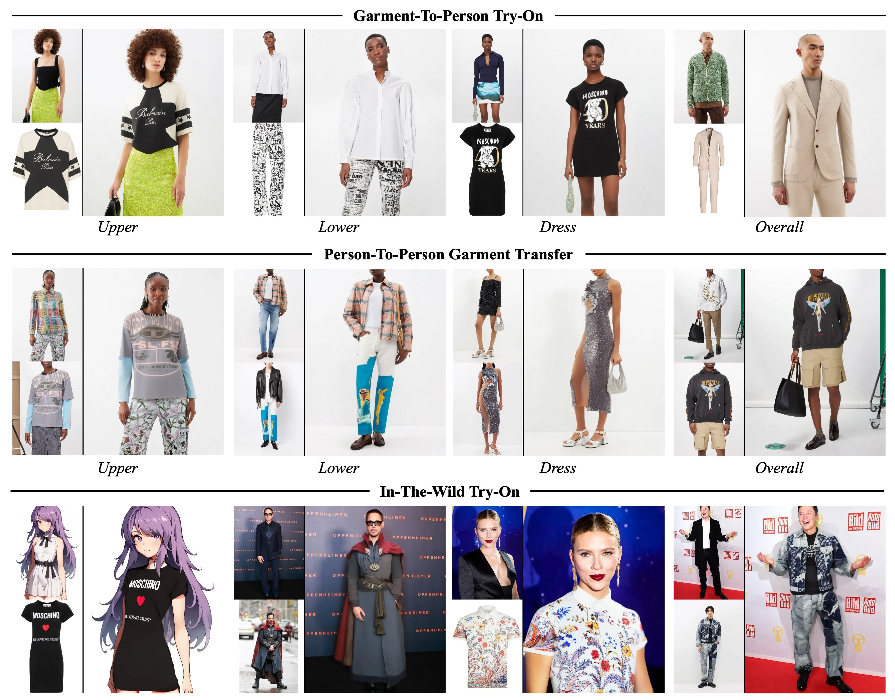

# Đồ án tốt nghiệp: Xây dựng ứng dụng thử đồ ảo (Virtual Try-On)

Đây là dự án khoá luận tốt nghiệp phát triển một hệ thống thử đồ ảo, cho phép người dùng xem trước hình ảnh của mình khi mặc một bộ trang phục mới từ một ảnh sản phẩm.

<div align="center">
  
</div>

## Mục lục
- [Giới thiệu](#giới-thiệu)
- [Kiến trúc hệ thống](#kiến-trúc-hệ-thống)
- [Công nghệ sử dụng](#công-nghệ-sử-dụng)
- [Hướng dẫn cài đặt](#hướng-dẫn-cài-đặt)
- [Hướng dẫn chạy chương trình](#hướng-dẫn-chạy-chương-trình)
- [Cấu trúc thư mục](#cấu-trúc-thư-mục)
- [Thông tin đồ án](#thông-tin-đồ-án)

## Giới thiệu
Dự án này tập trung vào việc ứng dụng các mô hình học sâu tiên tiến để giải quyết bài toán thử đồ ảo (Virtual Try-On). Hệ thống cho phép người dùng tải lên hình ảnh của chính mình và hình ảnh một bộ quần áo. Sau đó, mô hình AI sẽ xử lý và tạo ra một hình ảnh mới, trong đó người dùng đang mặc bộ quần áo đã chọn, với độ chân thực và chính xác cao về phom dáng, nếp gấp và ánh sáng.

## Kiến trúc hệ thống
Hệ thống được xây dựng dựa trên kiến trúc client-server, bao gồm các thành phần chính sau:

1.  **Giao diện người dùng (Frontend)**: Một ứng dụng web được xây dựng bằng **Flask** và HTML/CSS/JavaScript, cho phép người dùng tương tác, tải ảnh lên và nhận kết quả.
2.  **Máy chủ ứng dụng (Backend)**: Server Flask quản lý các yêu cầu từ người dùng, xử lý file và điều phối các tác vụ AI.
3.  **Lõi xử lý AI**:
    *   **Tiền xử lý**: Tách người và quần áo khỏi nền, tạo ra các "mặt nạ" (agnostic mask) và ước tính dáng người (dense pose).
    *   **Mô hình Try-On**: Sử dụng một mô hình khuếch tán (Diffusion Model) được tinh chỉnh, kết hợp hình ảnh người và quần áo để tạo ra ảnh kết quả cuối cùng.
    *   Các tác vụ AI được chạy dưới nền để không làm ảnh hưởng đến trải nghiệm người dùng.

```mermaid
graph TD
    subgraph "Người dùng"
        A[Trình duyệt Web]
    end
    
    subgraph "Web Server (Flask)"
        B{Application Server}
        C[Hàng đợi xử lý]
    end

    subgraph "Lõi AI (Python Backend)"
        D[Tiền xử lý <br/>(DensePose, SCHP)]
        E[Mô hình Virtual Try-On <br/>(Diffusion Model)]
        F[Ảnh kết quả]
    end

    A -- "1. Tải ảnh người & quần áo" --> B
    B -- "2. Tạo Job ID & đưa vào hàng đợi" --> C
    C -- "3. Gọi tiến trình AI" --> D
    D -- "4. Tạo Agnostic Mask & Dense Pose" --> E
    E -- "5. Ghép ảnh" --> F
    F -- "6. Lưu kết quả" --> B
    B -- "7. Trả kết quả về cho người dùng" --> A
```

## Công nghệ sử dụng
- **Backend**: Python, Flask
- **Frontend**: HTML, CSS (Bulma), JavaScript
- **Giao diện Demo**: Gradio
- **Học sâu (Deep Learning)**:
  - PyTorch
  - Diffusers (Hugging Face)
  - Detectron2 & DensePose
  - Transformers

## Hướng dẫn cài đặt

### 1. Yêu cầu
- Python 3.9+
- `git`
- (Khuyến nghị) GPU NVIDIA với hỗ trợ CUDA để tăng tốc xử lý AI.

### 2. Cài đặt
1.  **Clone repository về máy:**
    ```shell
    git clone <URL_CUA_REPOSITORY_NAY>
    cd VTON
    ```

2.  **Tạo và kích hoạt môi trường ảo:**
    ```shell
    python3 -m venv venv
    source venv/bin/activate  # Trên macOS/Linux
    # venv\\Scripts\\activate   # Trên Windows
    ```

3.  **Cài đặt các thư viện cần thiết:**
    ```shell
    pip install -r requirements.txt
    ```

4.  **Tải các mô hình (weights):**
    Chạy script sau để tự động tải các checkpoint cần thiết cho mô hình AI.
    ```shell
    python download_models.py
    ```

## Hướng dẫn chạy chương trình
Dự án có hai cách để khởi chạy giao diện.

### Cách 1: Chạy ứng dụng Web chính (Flask)
Đây là giao diện chính của ứng dụng, được thiết kế cho người dùng cuối.

1.  **Khởi động server:**
    ```shell
    python app_flask.py
    ```

2.  **Truy cập ứng dụng:**
    Mở trình duyệt và truy cập vào địa chỉ `http://127.0.0.1:5001`.

3.  **Sử dụng:**
    - Nhấn vào "Bắt đầu" để vào trang thử đồ.
    - Tải lên ảnh của bạn (toàn thân, rõ mặt) và ảnh sản phẩm quần áo.
    - Nhấn "Thử đồ ngay" và chờ hệ thống xử lý.
    - Kết quả sẽ hiển thị trên màn hình khi hoàn tất.

### Cách 2: Chạy giao diện Demo (Gradio)
Giao diện này cung cấp nhiều tùy chọn hơn để tinh chỉnh các tham số, phù hợp cho việc demo và phát triển.

1.  **Khởi động ứng dụng Gradio:**
    ```shell
    python app.py
    ```
2.  **Truy cập ứng dụng:**
    Mở trình duyệt và truy cập vào địa chỉ được hiển thị trong terminal (thường là `http://127.0.0.1:7860`).


## Cấu trúc thư mục
```
.
├── app_flask.py            # Entrypoint cho ứng dụng web Flask
├── app.py                  # Entrypoint cho giao diện demo Gradio
├── run_inference_task.py   # Script thực thi lõi AI
├── download_models.py      # Script tải các model weights
├── requirements.txt        # Danh sách các thư viện Python
├── templates/              # Chứa các file HTML cho Flask
├── static/                 # Chứa các file tĩnh (CSS, JS, images)
├── uploads/                # Thư mục lưu ảnh người dùng tải lên
├── results/                # Thư mục lưu ảnh kết quả
├── model/                  # Chứa mã nguồn của các mô hình AI
├── densepose/              # Mã nguồn cho DensePose
├── detectron2/             # Mã nguồn cho Detectron2
└── resource/               # Chứa các tài nguyên demo
```


